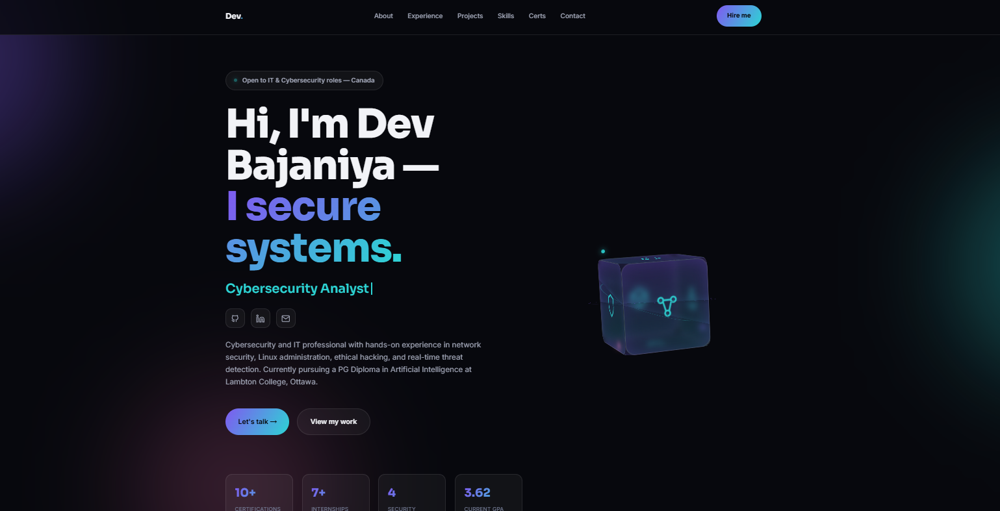

# Portfolio 2026 — Dev Bajaniya

A single-page, dark-themed cybersecurity portfolio for **Dev Bajaniya**. Built as a
self-contained static site (one `index.html` with inline CSS and JavaScript) — no build
step, no dependencies, no framework.



## Sections

- **Hero** — intro with animated typing effect and a 3D "core" visual
- **About** — background and focus areas
- **Experience** — internships and engagements
- **Projects** — selected security tools and lab work
- **Certifications** — earned credentials
- **Skills** — tools and technologies
- **Education** — academic timeline
- **Contact** — links to GitHub, LinkedIn, and email

## Tech

- Plain HTML5, CSS3 (custom properties, glassmorphism), and vanilla JavaScript
- Fully responsive, mobile-first layout
- Accessibility-conscious: ARIA attributes, `:focus-visible` styles, and semantic markup
- Respects `prefers-reduced-motion` — animations disable gracefully
- Progressive enhancement: content renders without JavaScript

## Running locally

No build step is required. Open the file directly:

```bash
# Option 1: open the file in your browser
open index.html

# Option 2: serve it locally (recommended so in-page anchors behave)
python3 -m http.server 8000
# then visit http://localhost:8000
```

## Deploying

Because it's a static site, you can host it anywhere:

- **Vercel:** import the repo and deploy — no configuration needed
- **GitHub Pages:** enable Pages on the `main` branch (root)
- **Netlify:** drag-and-drop the folder or connect the repo

## License

Personal portfolio project. All rights reserved unless stated otherwise.
